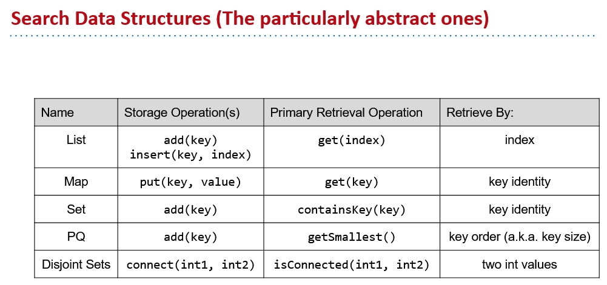
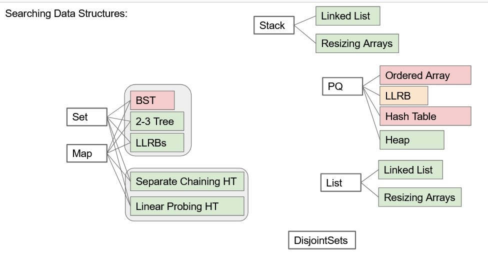
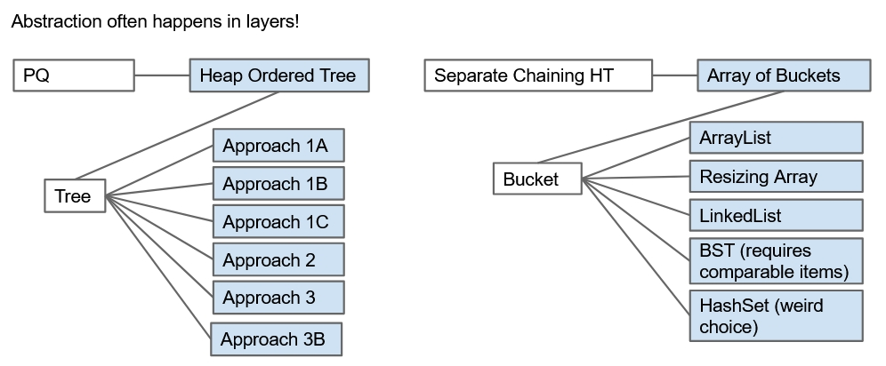

# Heap and Summary of Data Structures(CS61B Lecture20)

The note of **heap** part can be found [here](https://github.com/FSReed/ZJU_DS_Summer2023/tree/master/Notes)

## Summary of Data Structures

