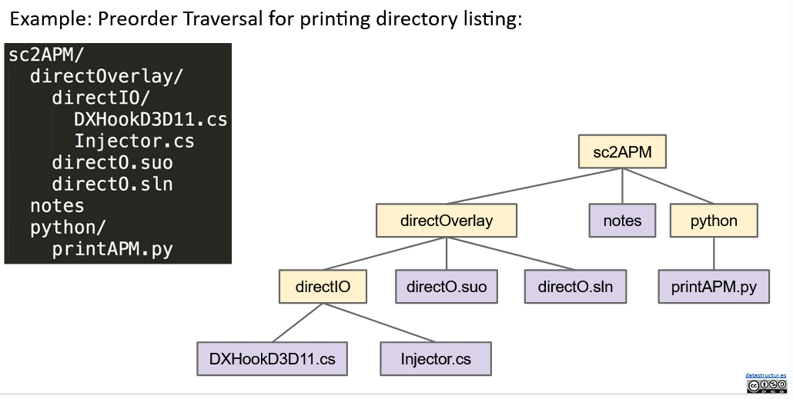
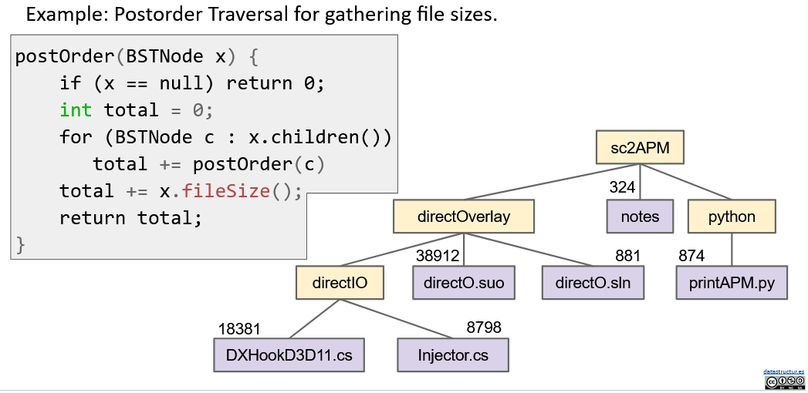
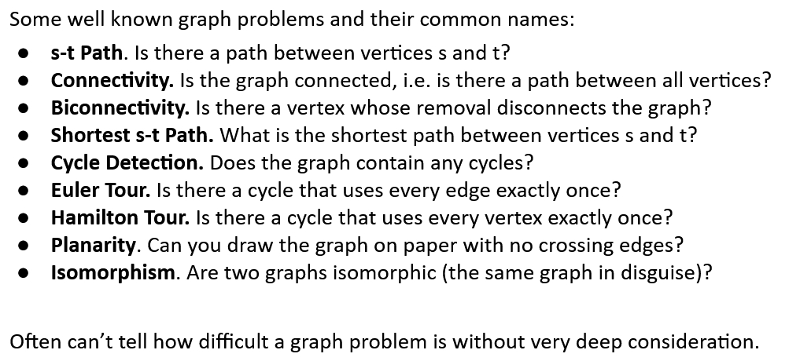

# Tree and Graph Traversal(CS61B Lecture21)

## Examples of Tree Traversal

- Draw the folder hierarchy using PreOrder.
  
- Calculate the size of the folder using PostOrder.
  

## Graph Problems

Notes can be found [here](https://github.com/FSReed/ZJU_DS_Summer2023/blob/master/Notes).
