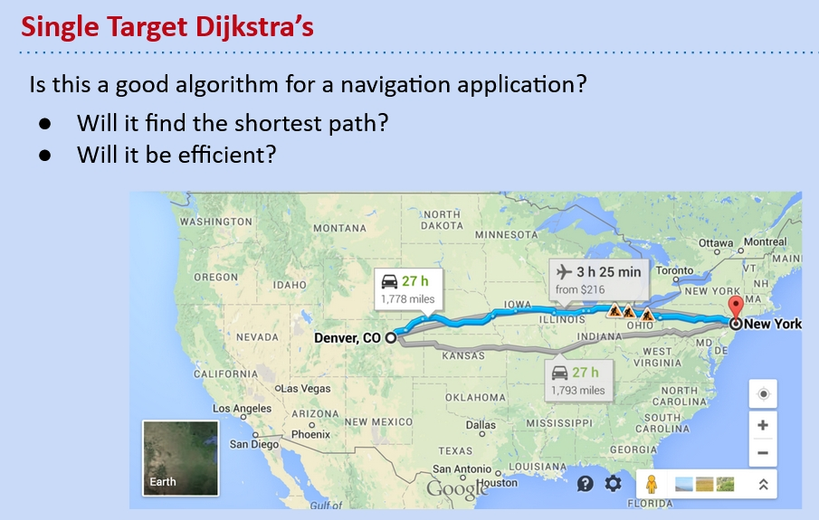
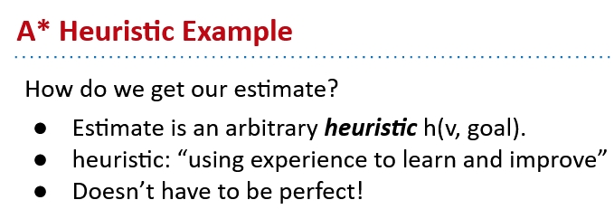
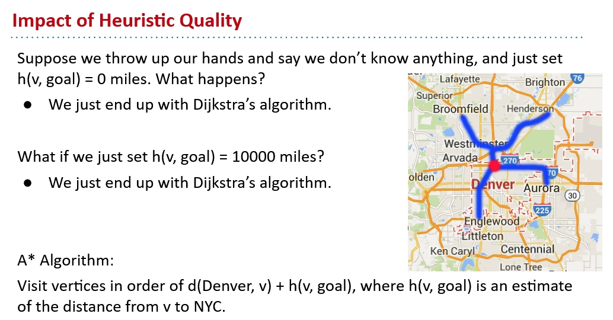
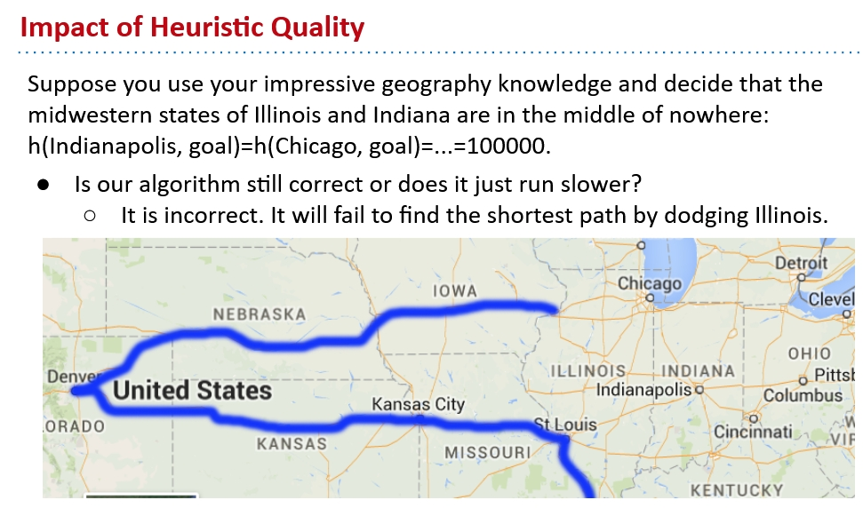

# `A*` Algorithm

See note for Dijkstra algorithm [here](https://github.com/FSReed/ZJU_DS_Summer2023/tree/master/Notes).
Dijkstra algorithm certainly works in graphs whose edges are always non-negative. But in each iteration, Dijkstra algorithm will start at a vertex that has the smallest distance from the source. What if we want to find the shortest path to a vertex that's far from the source?

In this problem, we are trying to get to NYC from Denver, but using Dijkstra, we have to search all the cities near Denver which is very inefficient. This also indicates Dijkstra should be used for **one-source, multiple-targets** problems.

## What's `A*`

Recall that in Dijkstra, we are visiting vertices according to their distances from the source:
$$
D_{Dijkstra} = d(current, source)_{min}
$$
In `A*`, we are **not only** considering the real distance from the source, but also the **estimated distance from the target**.
$$
D_{A*} = (d(current, source) + h(current, target))_{min}
$$

## `A*` Heuristic is AI

`A*` is not a rigorous approach to find the shortest path like Dijkstra. Instead, it's more likely to be an AI. The heuristic we choose would have huge influence on the behavior of A*.

Therefore, we can't guarantee `A*` will always give the correct result.

