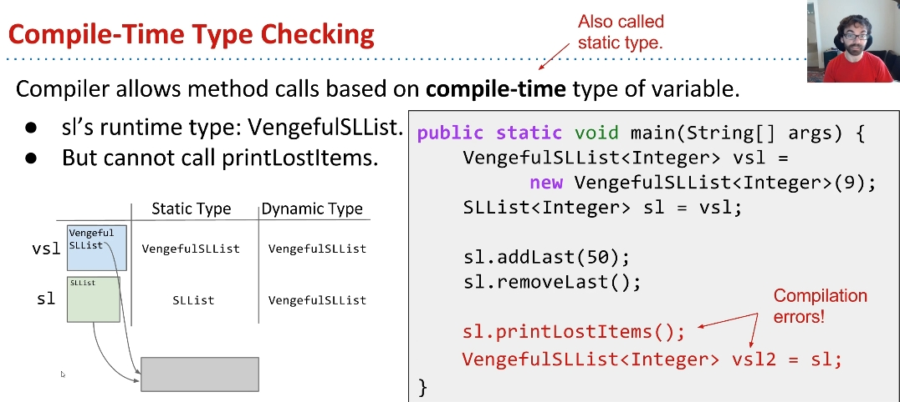

# Inheritance (CS61B Lecture 8)

[Lecture Video](https://www.youtube.com/playlist?list=PL8FaHk7qbOD7Ycy9QeJSPXVoTwAH52Rlw)

## Method Overloading

When a method can be used for 2 or more different classes, it's ok in Java to define multiple methods with same name.

### Downsides

1. Code will be unnecessarily long.
2. Repeating yourself is aesthetically gross.
3. More code to maintain.
   - Any change made to one, must be made to another.
   - So does bug-fixing.
4. Another class added, another function needed.

## Inheritance in Java

We will use a new keyword `interface` to define an Interface.

```Java
public interface Father<Item> {
    Interfaces;
}
```

Then the Inheritances would implement this interface, by using keyword `implements`

```Java
public class Inheritance1 implements Father<Item> {
    Implements1;
}

public class Inheritance2 implements Father<Item> {
    Implements2;
}
```

Then a method which takes in a Father object can be used on both Inheritances defined above.

## Overriding

If a "subclass" has a method with the exact same signature as in the "superclass", we say the **SUBCLASS** overrides the **METHOD**.

NOTE: We can add an `@Override` tag above the overridden methods. The only effect of this tag is: The code won't compile if it is not actually an overriding method.

## Interface Inheritance

- Interface: The list of all method signatures.
- Inheritance: The subclass "inherits" the interface from a superclass.
- Interface specifies what the subclass can do, but not how.
- Subclasses **MUST** overrides all of these methods!
  - Will fail to compile otherwise.

## Implementation Inheritance

In interface inheritance, subclass inherits signatures, but **NOT** implementation. How to make subclasses inherit implementations?

**Use `default` keyword to do this**

```Java
// Inside the class Father
default public void methodName() {
    Implementations;
}
```

Then this method can be straightly used in Inheritances.
Note: If a subclass wants to override the default method in Father class, an `@Override` tag is necessary. Without this tag, the method won't be overridden.

### The Dangers of Implementation Inheritance

[Check the video here](https://www.youtube.com/watch?v=9KuVnIje2Ys&list=PL8FaHk7qbOD7Ycy9QeJSPXVoTwAH52Rlw&index=11)

## Inherit from another class: Using keyword extends

When we want one class to be a hyponym of an interface, we use `implements`  
But when we want one class to be a hyponym of another class, we need to use a new keyword: `extends` like this:

```Java
public class InheritFromInheritance1 extends Inheritance1 {
    Implementations;
}
```

### How to override functions in subclasses?

We need another new keyword: **`super`**, like:

```Java
@Override
public void overridingMethod() {
    super.overridingMethod(); // This line means we are using the superclass's origin method.
}
```

### Calling Other Constructors

If we want to use a super constructor other than the no-argument constructor, we need to give the parameters to super. Otherwise we're calling the default constructor of super which has no arguments.

---

## Encapsulation(Lecture 9)

[Video link here](https://www.youtube.com/watch?v=GioVGLuW69o&list=PL8FaHk7qbOD6Mi8gDriGGeSnHi68QLuVD&index=6)

### The implementation inheritance can break the encapsulation

See the code down here:

```Java
public class Dog {
    public void bark() {
        barkMany(1);
    }

    public void barkMany(int N) {
        for (int i = 0; i < N; i++) {
            System.out.println("bark!");
        }
    }
}

public class VerboseDog extends Dog {
    @Override
    public void barkMany(int N) {
        System.out.println("As a dog, I say:");
        for (int i = 0; i < N; i++) {
            bark();
        }
    }
}
```

Everything seems to be fine, logically. Now assume `vd` is a VerboseDog instance, what will happen if we call `vd.barkMany(3)`?  
We'll get stuck into an infinite loop!

## Dynamic Method Selection and Compile-Time Type Checking

- If overridden, decide which method to call based on **run-time** type.
- Compiler allows method calls based on compile-time type of variable.

Here is the simple of the compile-time type checking. The *VengefulSLList* is a subclass of SLList, check this in [lecture video](https://www.youtube.com/watch?v=RJ_OpzLeHeQ&list=PL8FaHk7qbOD6Mi8gDriGGeSnHi68QLuVD&index=3)



Expressions have compile-time types.  
For example: `SLList<Integer> sl = new VengefulSLList<Integer> vsl;`. Compile-time type of tight hand side expression is VengefulSLList, and **A VengefulSLList is a SLList**, so the assignment is allowed. Therefore, is the two sides exchange, the assignment can't compile.

## Casting

Java has a special syntax for forcing the compile-time type of any expression. Put desired type in parenthesis before the expression.

---

## Subtype Polymorphism(Lecture 10)

This is confusing as I'm watching the lecture video for the first time. And Here is the [video link](https://www.youtube.com/watch?v=m2F-ekp_BRU&list=PL8FaHk7qbOD56r1sGUGifsfC0KRDAsuZ3&index=2)

**Polymorphism** is : "Providing a single interface to entities of different types."

### Example: [DIY comparison](https://www.youtube.com/watch?v=QRPVJ7Wxxtk&list=PL8FaHk7qbOD56r1sGUGifsfC0KRDAsuZ3&index=4)

Purpose: We want to write a function max() that returns the max of any array, **regardless of type**. If we just use `>, <` etc, it won't work for all types of course. We can do this in many approaches like:

- Leave this task to the actual class: Make a comparison in the class that we want to compare.
  - Disadvantage: If we need many classes to be compared, we need this repetition of work.
- Using Inheritance: Create an interface that guarantees a comparison method.Let the actual class we are comparing implement this interface, then we can pass in the interface object in, and return the interface object. Check this in the video mentioned above.

The code looks like this:

```Java
public interface OurComparable {
    public int compareTo(Object o);
}

public class Dog implements OurComparable {
    public int size;

    public int compareTo(Object obj) {
        Dog randomDog = (Dog) obj;
        return this.size - randomDog.size;
    }
}

public class Maximizer {
    public static OurComparable max(OurComparable[] a) {
        ...
    }
}
```

**Warning**: The casting in Dog class may cause runtime-error, e.g. when a programmer tries to compare 2 different type of objects.

### What would Java perform?

Consider all the codes provided above and think:

- If we delete the whole implementation in Dog class, which file would fail to compile?
- If we delete **`implements OurComparable`** in Dog class declaration, which file would fail to compile?

In the second question, here's the key point: **Everything will perform normally EXCEPT DogLauncher**, because DogLauncher is trying to pass a `Dog` list to Maximizer, and Maximizer needs `OurComparable` to compare. If we delete **`implements OurComparable`**, this means Dog is no longer an `OurComparable`. But `Maximizer` and `OurComparable` won't fail to compile, because it's like **the interfaces are there, waiting for the implementations (Like Dog) to come**.

## [Comparable](https://www.youtube.com/watch?v=iQoN9bt8GJc&list=PL8FaHk7qbOD56r1sGUGifsfC0KRDAsuZ3&index=6)

Java has a built-in Comparable class, using Generic. Then we can modify our Maximizer so that many built-in types can be compared.

## [Comparator](https://www.youtube.com/watch?v=1oow3NGoExg&list=PL8FaHk7qbOD56r1sGUGifsfC0KRDAsuZ3&index=7)

As higher-order-functions(HOFs) can pass the function as the parameter, and it can implement different type of comparison by passing different functions, we may wonder how to do this using subtype polymorphism. We can use the interface `Comparator` to do this.  
**Notice:** We are defining the Comparator class **INSIDE** the Dog class!

```Java
// In Dog class:
private static class SizeComparator implements java.util.Comparator<Dog> {
    public int compare(Dog a, Dog b) {
        return a.size - b.size;
    }
}

public static java.util.Comparator<Dog> getSizeComparator() {
    return new Dog.SizeComparator();
}
```

Now we can use this in DogLauncher class:(a, b are both Dogs)

```Java
java.util.Comparator<Dog> scmp = Dog.getSizeComparator();
if (scmp.compare(a, b) < 0) {
    a.bark();
} else {
    b.bark();
}
```

This is the comparator of the Dog.size, we can compare anything of any class using `Comparator<T>`.
