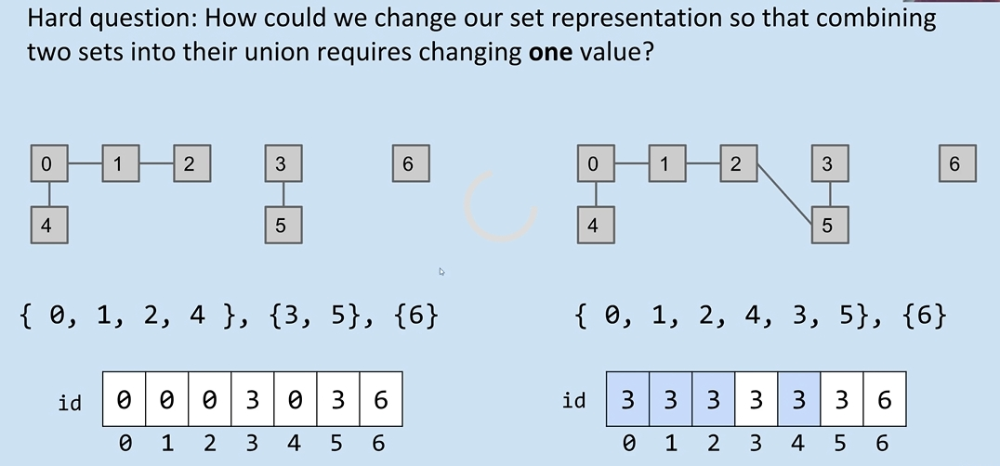
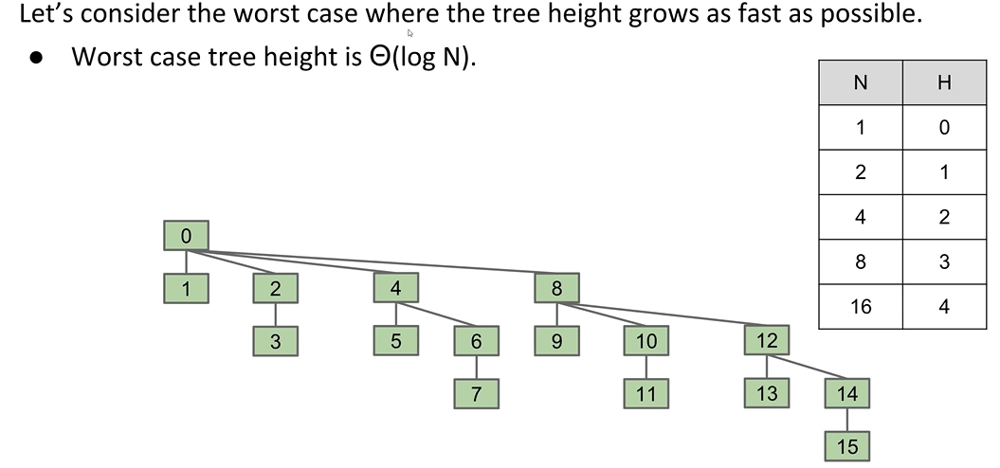
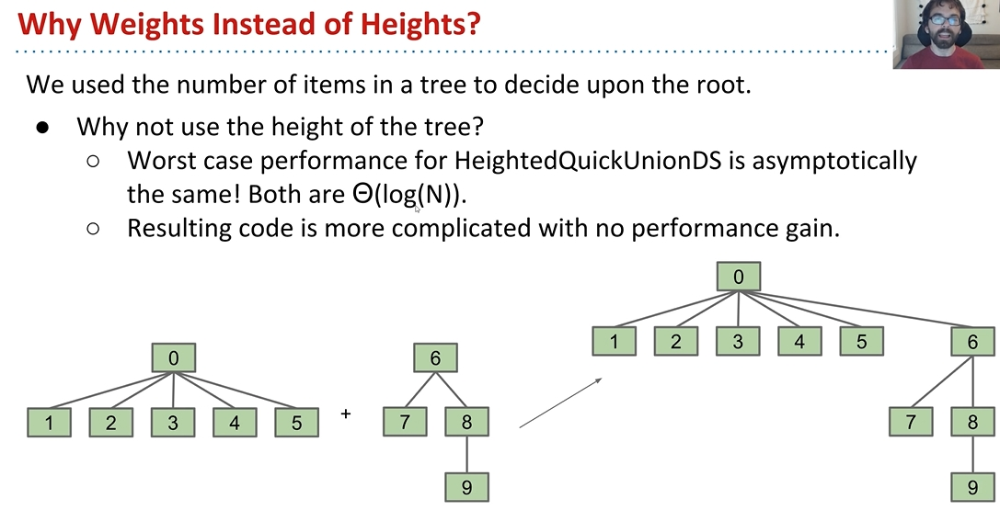

# Disjoint Sets(并查集) (CS61B Lecture 14)

The purpose we are building a Disjoint set is to connect different things, and check whether two different items are connected. The interface of a disjoint set will include `connect` and `isconnected`.

## Key point

We're not going to record every single operation of `connect`, that's silly. We're going to put 2 connected items in the same **SET**, and all items connected to a specific item is the items in the same set with this specific item.

## Quick Find and Quick Union

We need to choose a data structure to store the disjoint set. What DS should we choose?

- List: A list to store each different set. The `connect` and `isConnected` will be as slow(Linear time).
- Array, where `array[position]` stores which set the item `position` belongs to. In this case, `isConnected` will be fast, but `connect` is still slow.

Now the question is: **If we still use array, how to change the value stored in the array to make `connect` fast.**


**Answer**: We make each `array[position]` track the **parent** of item `position`. And for the item which has no parent, its parent will be set to -1. This is **Quick Union**.

- When we try to use `isConnected`, we can just find the root of one item and judge whether they're the same root.
- When we try to connect two items, we can judge if they belongs to the same set. If not, then add all items in one set to another set.

By doing this, we can imagine the worst situation, when the tree becomes too tall. Consider when we do something like:

```Python
connect(4, 3)
connect(3, 2)
connect(2, 1)
connect(1, 0)
```

Finally we will get a tree with depth being 4, and when the data gets large, finding root will become really slow.

## Weighted Quick Union Performance

If we add a new rule: **attach the root which has less items to the root which has more items**, the performance will be much more better.
You may have a question: *We are considering how to make the height of the tree smaller, why not using height of root to do the merge?*  
Let's ponder the worst situation of weighted quick union: When merging a single item into a 2-item set, according to weighted quick union rule, we must add this single item to the 2-item set's root, which doesn't change the height of the tree. So if we want to increase the height of the tree, we need to connect two trees with same amount of element, and so force, we can prove that the maximum height of N items set will be $log_2(N)$. In fact, if we try to just minimize the height of the tree, the performance will be the same as weighted quick union.



The reason why we choosing weighted quick union is: it's much easier to implement than heighted quick union. Because we're just recording the size of the root, we can use like $-1, -2, -3...$ to represent the size of the root is $1, 2, 3...$.


