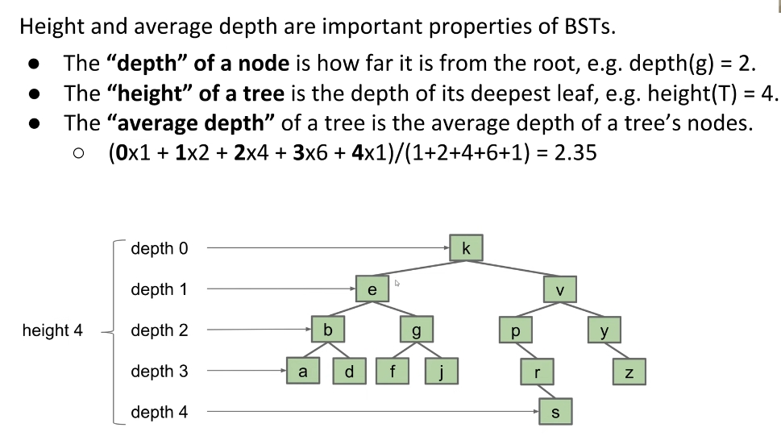

# B Trees(CS61B Lecture 17)

## Tree Height and Depth

They are all true! But the first statement is more **informative**.

The **Height** determines the **worst** runtime to find a node. And the **Average Depth** determines the average runtime to find a node.  

### What about the BSTs in real world?  

- Fun fact is that **randomized trees' average depth is $\Theta log(N)$!** The proof can be really complicated.
  
- But we can't always insert nodes in a random order. For example, if we are trying to store the date, as time goes by, the date will become larger and larger, which makes our tree to be spindly.

## B-Tree

### Why B Trees?

As is mentioned before, the worst case of a BST can take $\Theta N$ operations to find a node(in a spindly tree). We need to come up with a new ADT to avoid this worst case.

### Basic concepts of B Trees

The idea is: As we are adding more nodes, the tree might be spindly, and we want the tree to be bushy. Here're the thoughts:(Assume we are always adding elements that are bigger than any element in the tree now)

1. First, we try to make the node to become a **List**, which means we are adding new elements straight to the existing leaf node. Now the height of the tree can stay unchanged, but we can see the tree will finally degenerates into a linked list.
   
2. So we are going to limit the length of the node, like $L = 3$, now when there're more elements than L in a node, we'll move one element onto the parent node.
   
   The solution is:
   
   Now we add 2 more elements to the tree, it's natural that the parent node will have 4 children instead.
   

**This is the basic idea of insertion of B trees.**

### What if a parent node's length is larger than L?

We send element 21 up, now the parent node have 4 elements. Then we send 17 up to the root, and split the node again:

### What if the root node's length is larger than L?  

We will still send the left middle element up, and **Let it be the new root!**

## B tree invariants

These invariants guarantees that B trees must be bushy.

### Discussion about the runtime of B Trees

[Here is the lecture video](https://www.youtube.com/watch?v=Cg7k5wKGk_Q&list=PL8FaHk7qbOD41EHkD7CgQuRw1jpH_Fv7-&index=6).  
Some key points are:

- The largest height is all non-leaf nodes have 1 item. The smallest height is all non-leaf nodes have 2 items. Thus the height will go between $log_{L+1}(N)$ and $log_2(N)$, and the overall height is exactly $\Theta log(N)$.
- Overall Runtime for contains and adds are both $O(log(N))$.
  
- Deletion is too intricate, so it won't be discussed here.

## Summary

