# Red Black Trees(Cs61B Lecture 18)

## Tree Rotations

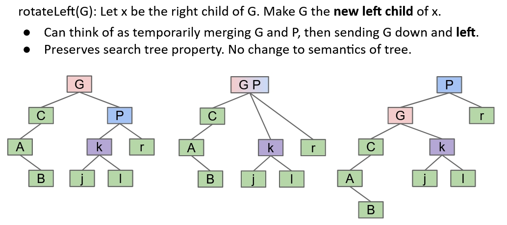

In this example, we can see that after rotation, the tree is very unbalanced. Now if we do `RotateRight(P)`, the tree will change back to its original state and the height of the tree will decrease.

With rotations, we can balance the BSTs.

## Red Black Trees

### Idea: Representing a 2-3 Tree as a BST

The idea is that a 2-3 tree is balanced by construction and don't need any rotations. Can we build a BST that's structurally identical to a 2-3 tree?  

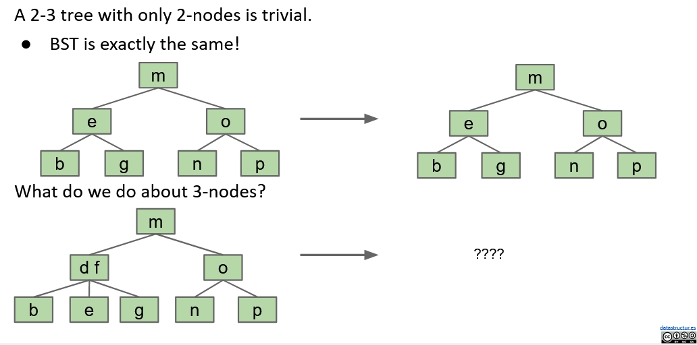
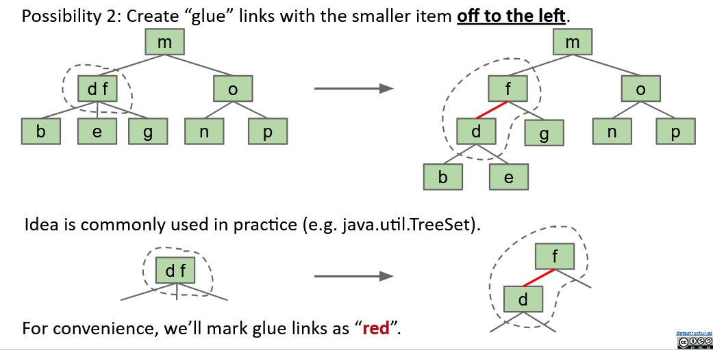

A BST with glue links that represents a 2-3 tree is often called a **Left Leaning Red Black Binary Search Tree** or **LLRB**.  

- The **Red** here is just a fiction. It doesn't do anything special.
- LLRBs are just normal BSTs.

And here are some properties of  LLRB:  

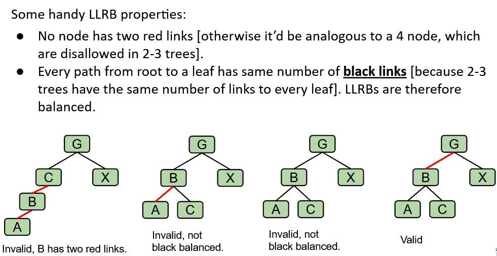

Here comes the question: We are trying to avoid the complex construction of B-Trees, and now we are building a B-Tree then convert it to a BST. What's the point??  
The idea is: We are not building a B-Tree, instead, we will insert a node as usual, then **use zero or more rotations to maintain the 1-1 mapping**.

### The Simple Basic Operations of Red Black Trees

- Insertion: Always use a **Red Link**.
  
  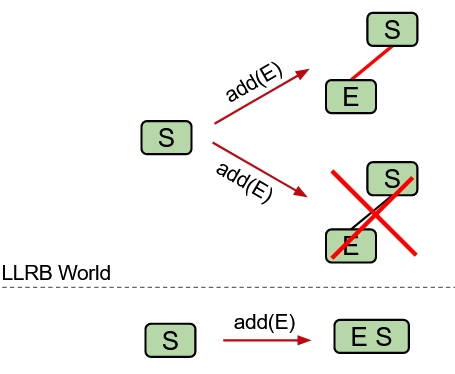

- Insertion On The Right: Still red link, but we need to **RotateLeft** one node to make it left leaning.  
  
  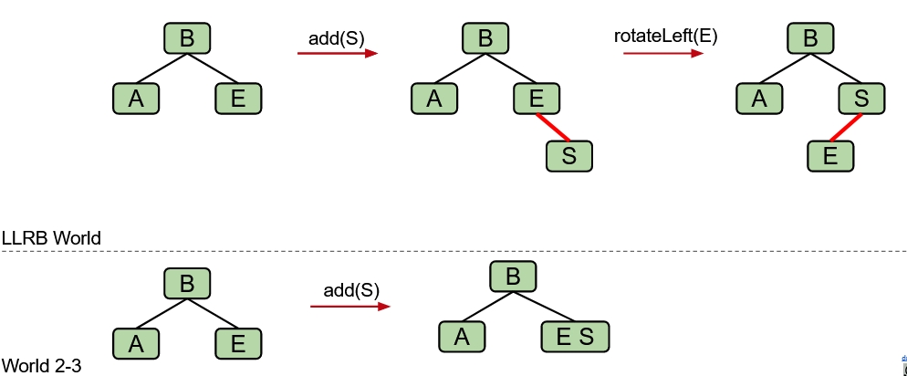

- **Double Insertion On the Left**: We need to **RotateRight** one node, but get a **temporary** state which violates the left leaning principle.  
  
  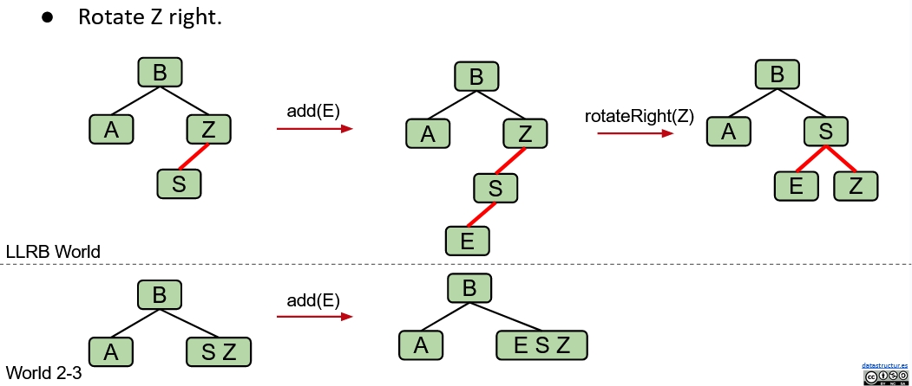
  
  In this case, the node `S` becomes a 4-Node, we need to split the temporary 4-Nodes.
- **Splitting temporary 4-Nodes**:  
  
  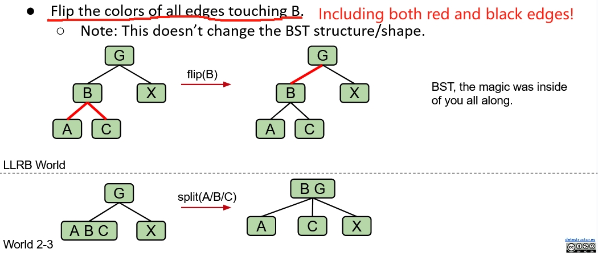
  
These are all the operations we need! In conclusion:  

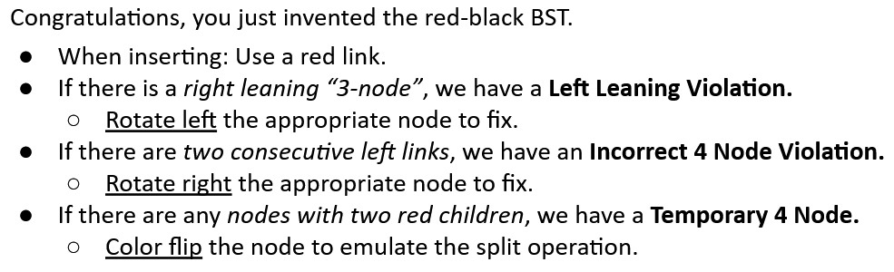

There's one situation that we need to pay attention to: What if after splitting, there's a red link which is right leaning?  

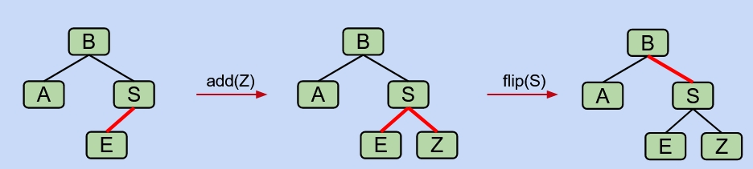

The answer is simple: just treat this as an insertion on the right!

### A little demo for Red Black Trees Insertion

[Demo here](https://docs.google.com/presentation/d/1jgOgvx8tyu_LQ5Y21k4wYLffwp84putW8iD7_EerQmI/edit#slide=id.g463de7561_042).  
Insert 7 to 1 into an empty LLRB. You should end up with a perfectly balanced BST!

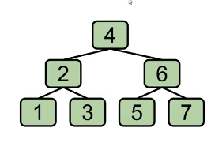
