# Hash Tables(CS61B Lecture19)

## Limits of Search Tree Based Sets

- The summary of the search trees till now:
  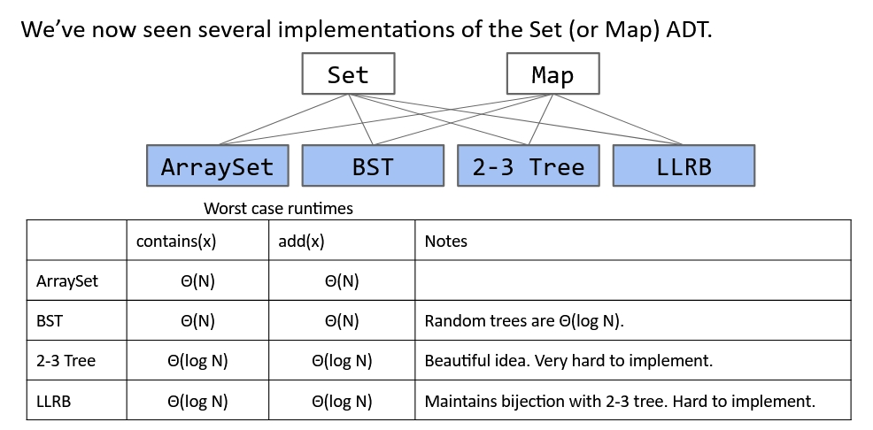
- We need to be able to ask `is X < Y?`. Not true for all the types. Can we avoid the needs for objects to be comparable?
- $\Theta log(N)$ is great, but could this be better?

## Data Indexed Integer Arrays

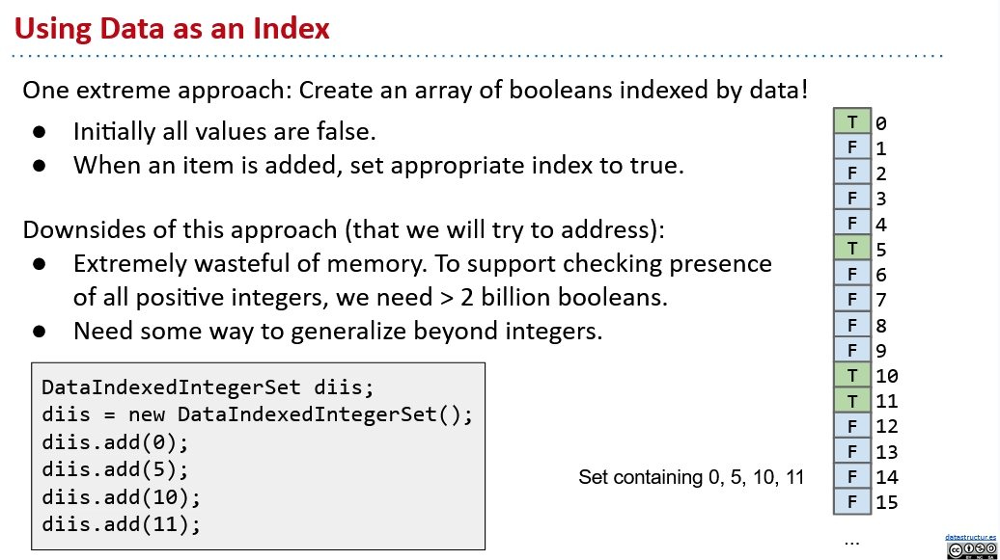

Though it takes constant time for `add` and `contain`, but we need to store a huge amount of `False`s in the memory which is a huge waste. What's more, we can only store integers in this way. So how can we generalize this method?

## Generalize to English words

### Collision

Assume that we are trying to store words like:

```C++
add('cat');
add('fish');
add('zebra');
```

How can we represent the `cat`th element in the list? If we only use the first character of the word as the index like `a = 1, b = 2, ..., z = 26`, when we try to add `cow` to the list, **the `cow` will collides with `cat`**.  

### Avoid Collision

First, let's review the representation of decimal numbers:  
$$7091_{10} = 7 \times 10^3 + 0 \times 10^2 + 9 \times 10^1 + 1 \times 10^0$$  
How can we represent $cat$ in this way? Notice that the characters' indices start from 1 not 0.  
$$ cat_{27} = 3 \times 27^2 + 1 \times 27^1 + 20 = 2234_{10}$$  
Now let's try another representation, `bee`:  
$$bee_{27} = b \times 27^2 + 5 \times 27^1 + 5 = 1598_{10}$$  

### Extend the range

We cannot represent something like `2Rg!76EE` using base 27. To represent this, we need **ASCII** to help us:

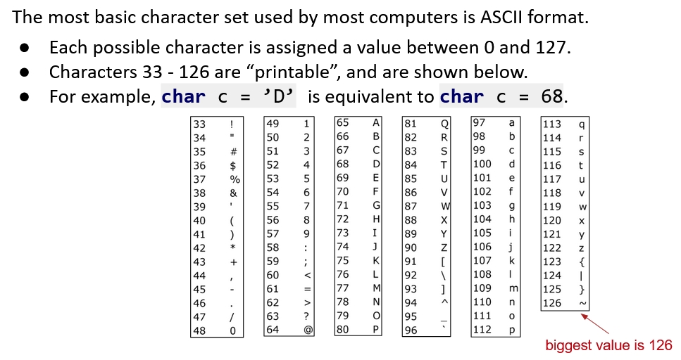

Now the representation of `eGg!` in base 126 will be:  
$$eGg!_{126} = 101 \times 126^3 + 71 \times 126^2 + 103 \times 126^1 + 33 = 203,178,183_{10}$$  
This only fits the pure English environment. What if we want to represent other languages? Use **Unicode**! And the largest value for Chinese characters is **40959** so we will use this as the base. For example:  

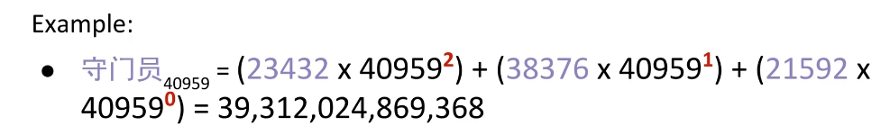

The result can be really really big, what should we do to solve this?

### Integer Overflow

- The overflow can cause the collision!  
  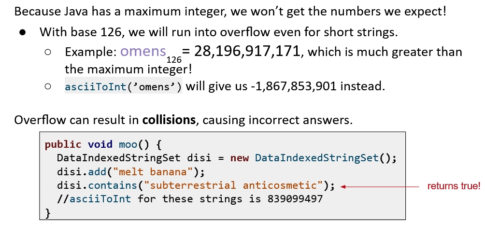
- The official term of the number we are computing is **Hash Code**. But it's guaranteed that there must be a collision no matter what hash code we are using, because there are infinite objects.
- Our 2 challenges will be:
  - Handling collision
  - Computing hash code

## Handling Collision

We've already known that the collision is inevitable. So the idea is to put the elements with the same hash code into the same bucket. Inside the bucket, we can use whatever ADTs we want to store these elements like Linked Lists.  

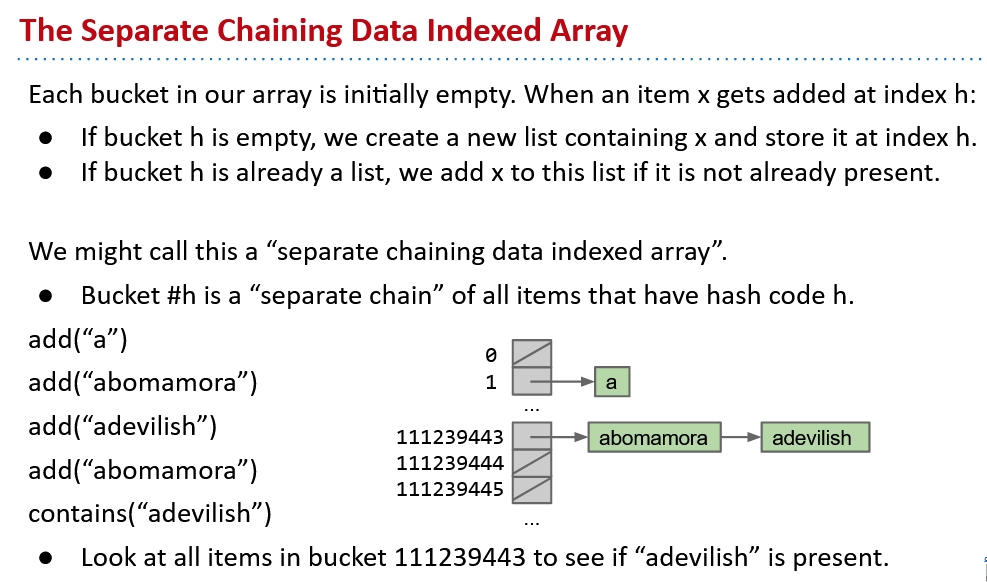
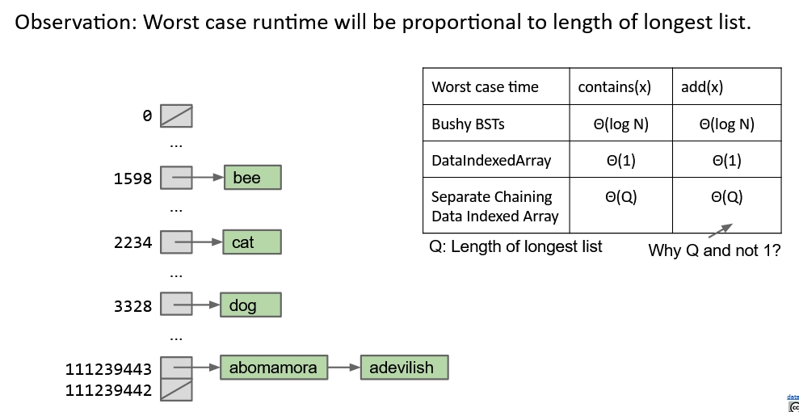

But there are too many buckets. We can only take the last digit of the hash code as the bucket this code belongs to. In this way, the number of buckets is reduced to 10.

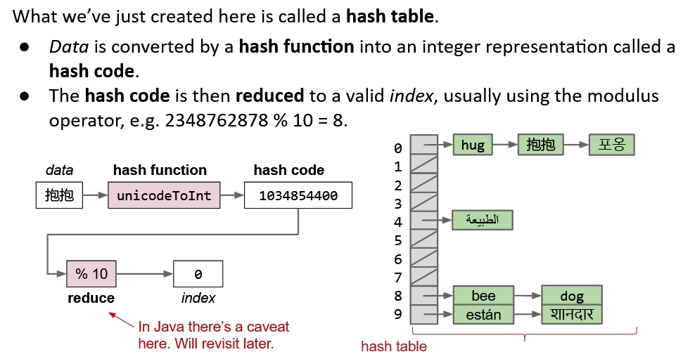

What about the performance of Hash Tables?

## Performance of Hash Table

In the primary implementation of Hash Table, we can see the order of growth of Q will be $\Theta log(N)$ because we only have 10 buckets. Thus even in the best case, $Q$ will be $N/10$, which is really bad!  
Now say we have $M$ buckets, how can we guarantee that $N/M$ is $\Theta (1)$?

### Resize the Bucket

The answer is very intuitive. We should make $M$ grows as $\Theta (N)$.  

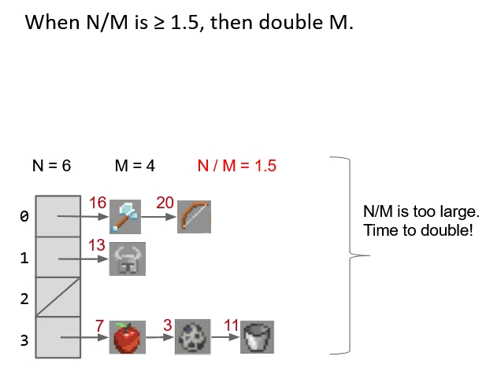
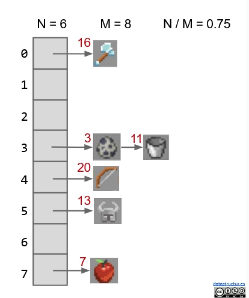

So as long as we keep the bucket number grows as $\Theta (N)$, most operations will only take $\Theta (1)$ time! That's pretty amazing!  
**Why most, but not all?** Because some operations may cause resizing of the hash table and resizing will take $\Theta (N)$ time because we need to redistribute all the items. However, as long as **the elements are evenly spread** and **we resize the hash table in a multiplicative factor**, the **average runtime will be $\Theta (1)$.**  
So how to guarantee an even distribution?  

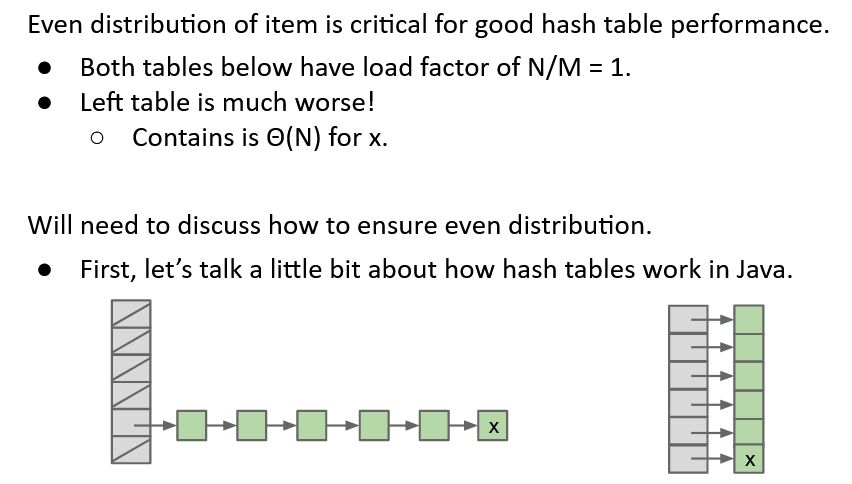

## *What Makes a good Hash Function?*

[Video Link](https://www.youtube.com/watch?v=14f8LxYREFQ&list=PL8FaHk7qbOD67rFIKNVkDcucFwNjUq9-d&index=8)
