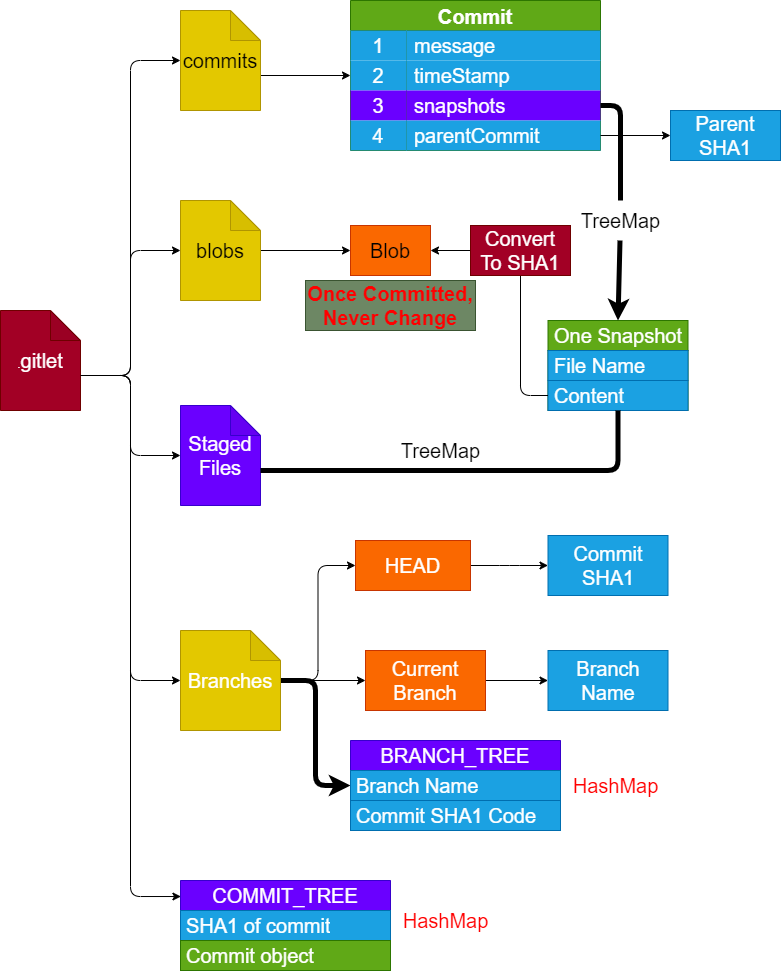

# Gitlet Design Document

**Name**: FSReed

## Classes and Data Structures

### Commit

#### Fields

```Java
/** The message of this Commit. */
public String message;

/** The timestamp of this Commit. */
public String timeStamp;

/** The files that has been changed in this Commit.
 *  The mapping of file name -> sha1 of the blob
 */
public TreeMap<String, String> snapshots;

/** The parent commit, represented using hash code */
public String parentCommit;

/** The Constructor */
public Commit(String m, String parentHash) {
    this.message = m;
    this.timeStamp = getTime();
    this.parentCommit = parentHash;
    this.snapshots = new TreeMap<>();
}
```

### Repository

#### Fields

```Java
/** The current working directory. */
public static final File CWD = new File(System.getProperty("user.dir"));
/** The .gitlet directory. */
public static final File GITLET_DIR = join(CWD, ".gitlet");
/** The commits directory */
public static final File COMMIT_PATH = join(GITLET_DIR, "commits");
/** The blob directory */
public static final File BLOB_PATH = join(GITLET_DIR, "blobs");
/** The snapshot map inside the Staging Area */
public static final File STAGED = join(GITLET_DIR, "Staged Files");
/** The branches of the repo. */
public static final File BRANCH_PATH = join(GITLET_DIR, "branches");
/** The HEAD of the repo */
public static final File HEAD = join(BRANCH_PATH, "HEAD");
/** The current branch of the repo */
public static final File CURRENT_BRANCH = join(BRANCH_PATH, "Current");
/** Use hashmap to store the branches
 * The mapping is: branch name(String) -> sha1 code of the commit(String)
 */
public static final File BRANCH_TREE = join(BRANCH_PATH, "BRANCH_TREE");

/** Use hashmap to store the commits
 * The mapping is: sha1 code of the commit(String) -> commit(Commit)
 */
public static final File COMMIT_TREE = join(GITLET_DIR, "COMMIT_TREE");

/** Used for lazy-load and lazy-cache */
public static HashMap<String, Commit> commitTree = null;
public static HashMap<String , String> branchTree = null;
public static TreeMap<String, String> stagedTree = null;

/** Status code for checkout a file */
public static final int CHECKOUT_SUCCESS = 0;
public static final int CHECKOUT_NO_COMMIT = 1;
public static final int CHECKOUT_NO_FILE_IN_COMMIT = 2;

/** Status code for checkout to a branch */
public static final int CHECKOUT_NO_BRANCH_EXISTS = 3;
public static final int CHECKOUT_SAME_BRANCH = 4;
public static final int CHECKOUT_UNTRACKED_FILE = 5;

/** Status code for rm-branch */
public static final int RM_SUCCESS = 0;
public static final int RM_CURRENT_BRANCH = 1;
public static final int RM_NO_SUCH_BRANCH = 2;

/** Status code for reset */
public static final int RESET_SUCCESS = 0;
public static final int RESET_NO_COMMIT = 1;
public static final int RESET_UNTRACKED_FILE = 2;
```

### FileHeap

#### Fields

```Java
private String[] fileNames;
private int size;
private final int capacity;
public FileHeap(int capacity) {
    this.size = 0;
    this.capacity = capacity;
    this.fileNames = new String[capacity + 1];
    fileNames[0] = null;
}

/* Interfaces */

public void add(String fileName);
public void printWithTarget(String currentBranch);
// Won't reuse this heap again after printing.
```

## Structure of the repository



## Persistence

1. The SHA1 of a **Commit** can be computed as:

   ```Java
   String result = commit.message
                + commit.timeStamp
                + commit.snapshots.toString()
                + commit.parentCommit;
    String fileName = sha1(result);
   ```

2. The SHA1 of a **Blob** can be computed using the content of the blob straight forward.
3. In `branches`:
   - **HEAD** is serialized to store the **SHA1 code** of the commit at HEAD.
   - **Current** is serialized to store the **name** of the current branch.
   - **BRANCH_TREE** is a `HashMap` serialized to store all the branches, with a mapping of **branch-name -> commit SHA1 code**.
4. Staged Filed is a `TreeMap`.
5. `COMMIT_TREE` is a `HashMap`.

## Designs in this project

1. I need to come up with a way to serialize **Commit**s. As all metadata one commit has can guarantee this commit is unique, so I simple add up all the attributes of one Commit into one String and SHA1 this String.
2. When getting changed files stored in the staging area, I need to iterate over the `Staged Files`. But Java can't iterate over a TreeMap using `foreach` directly so I went to [StackOverflow](https://stackoverflow.com/questions/1318980/how-to-iterate-over-a-treemap) to find a way to implement the iteration.
3. **Unsolved**: In `rm`, the runtime requires to be constant. But I need to search a file in the staging area and the snapshot map of the current commit. Both staging area and snapshot map use a TreeMap to store the data. Do I need to switch to HashMap?
4. In staging area, I use a **FileName -> null** pair to represent removals.
5. Use a class named `FileHeap` to print the entries in lexicographic order. The data structure used in this class is a **minimum-heap**.
6. Add 3 static Map variables into the repo. These variables are used to implement **Lazy-load** and **Lazy-cache**.
